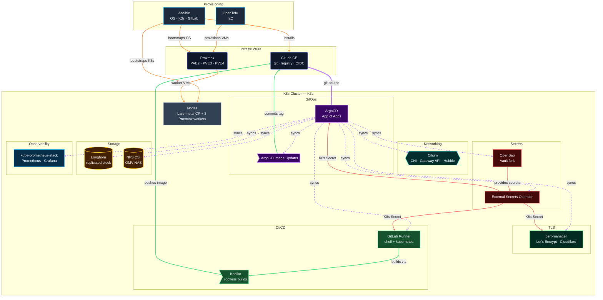

> This post is the start of the [Homelab K8s GitOps series](/categories/homelab/). Jump directly to any post using the roadmap table below.

## TL;DR

- **What:** A 14-post series building a production-grade homelab Kubernetes cluster with full GitOps — every component version-controlled, every secret managed, every deployment automated.
- **Why self-hosted:** Cloud Kubernetes costs real money at homelab scale. Self-hosting teaches you the stack you're actually running.
- **Stack:** OpenTofu · Proxmox · Ansible · K3s · Cilium · ArgoCD · GitLab CE · cert-manager · Longhorn · OpenBao · ESO · kube-prometheus-stack
- **Key gotcha:** My Proxmox nodes are standalone — not clustered. This changes how OpenTofu authenticates to each node.
- **Read time:** ~10 min

## What This Post Covers

This is the architecture overview for a 14-post homelab kubernetes gitops series. I'll explain what the full stack looks like, why each layer exists, and walk through the key decisions that shaped the design. The series roadmap at the bottom links to every post.

By the end of this series, you'll have a working cluster where every change goes through git, every secret lives in a vault, and the cluster can rebuild itself from code.

## Why GitOps at All

I've run homelabs without GitOps. It goes like this: you install something manually, it works, you tweak it over time, and eventually you have no idea what's actually running or why. When something breaks — and it will break — you're reverse-engineering your own infrastructure from memory.

GitOps fixes this with one rule: if it's not in git, it doesn't exist. Every component has a Helm values file or Kubernetes manifest in the repository. ArgoCD watches the repository and reconciles the cluster to match what's committed. Every change produces a commit, which means every change is auditable. Roll back a misconfiguration? `git revert` and push.

The setup cost is real — this is a full 14-post series, not a weekend project. The payoff is a cluster that's reproducible from scratch and a git log that tells the story of every decision.

## Why K3s + Cilium

K3s and Cilium are a deliberate pairing, not independent choices.

I chose K3s over kubeadm for two reasons.

First, embedded etcd eliminates an external dependency. With kubeadm, you need to manage etcd separately — either as a systemd service or as static pods with their own storage, backup, and restore procedures. K3s manages etcd internally. It snapshots automatically and the snapshot restore procedure is one command.

Second, single binary means single upgrade path. `systemctl stop k3s` + replace the binary + `systemctl start k3s`. Done. There is no kubeadm upgrade dance with `kubeadm upgrade plan` and `kubeadm upgrade apply` and "do this on every node in the right order."

I chose Cilium over Flannel because it does more than route packets. It is the only CNI that implements the Kubernetes Gateway API natively — no Nginx, no Traefik, no separate ingress controller needed. Cilium handles L4/L7 routing, NetworkPolicy enforcement, load balancer IP assignment, and network observability via Hubble, all from one Helm chart. It replaces kube-proxy using eBPF, which gives you per-connection observability and better node-level networking performance than iptables-based routing.

Cilium is not a homelab curiosity. Datadog and Adobe run it in production. It is what large platform engineering organizations reach for when they need CNI, Gateway API, and network observability from one tool. Learning it in a homelab means learning the same thing production platform teams are running.

The K3s and Cilium pairing has one non-obvious requirement: K3s must start with `--disable traefik --disable servicelb --disable-kube-proxy` set before Cilium is installed. If kube-proxy is already running when Cilium tries to take full replacement mode, you will have a bad afternoon of non-deterministic routing failures. I cover this in detail in Post #2 and Post #3.

## Why Self-Hosted

Cloud Kubernetes costs money. A managed three-node cluster on any major cloud provider runs $200–$400 per month before storage, egress, or load balancers. My homelab runs on hardware I already own, consumes electricity I'm already paying (all 4 Proxmox nodes are already always on for my other workloads), and sits behind a home router I'm already managing. The marginal cost of the cluster itself is near zero.

Beyond cost, there's the learning argument. When EKS or GKE hides the control plane from you, you don't learn how the control plane works. You learn how to configure managed add-ons. Running K3s on bare metal and VMs means I've debugged etcd health, traced CNI initialization order issues, and written my own Ansible roles for cluster bootstrap. That knowledge transfers. Cloud abstractions don't.

Data sovereignty is the third reason. GitLab, the container registry, and monitoring data live on hardware in my house. They're not in a shared cloud tenant.

## The Full Stack

Here's every layer, what it does, and why it's there.

**OpenTofu** — Infrastructure as Code. Provisions Proxmox VMs via the `bpg/proxmox` provider. State stored in a GitLab HTTP backend. I chose OpenTofu (the Linux Foundation fork of Terraform) because it's the only mature IaC tool with a real Proxmox provider. OpenTofu runs locally for the GitLab VM (Phase 0) and through GitLab CI for the K8s worker VMs.

**Proxmox** — Hypervisor on three physical nodes (PVE2, PVE3, PVE4). Worker VMs are provisioned here by OpenTofu using cloud-init for OS configuration and SSH key injection. One node (PVE4) hosts the GitLab VM. The other two host K8s workers.

**Ansible** — OS and K3s bootstrap. Configures swap, UFW, netplan, and timezone on every node. Installs GitLab CE with Certbot and Pangolin on the GitLab VM. Installs K3s with the right flags on the control plane and workers. I use Ansible Vault for all secrets — GitLab root password, Cloudflare token, Pangolin credentials.

**K3s** — Kubernetes itself. Single-node control plane running on a bare-metal laptop (physical node, not a VM — I had a spare laptop). Three worker VMs across the Proxmox nodes. Embedded etcd. Server and agents managed by the Ansible K3s role.

**Cilium** — CNI, kube-proxy replacement, and Gateway API controller, all in one Helm chart. The reason I chose Cilium over anything else: it's the only CNI that implements the Kubernetes Gateway API natively. No Nginx, no Traefik, no separate ingress controller. Cilium handles L4/L7 routing, NetworkPolicy, load balancer IP assignment, and network observability via Hubble. It replaces kube-proxy using eBPF, which also improves node-level networking performance.

**ArgoCD** — GitOps controller. Watches the GitLab repository and syncs every manifest in `k8s/` to the cluster. I use the App of Apps pattern: one bootstrap Application points to a directory of other Application manifests. Adding a new cluster component is a single file commit.

**GitLab CE** — Self-hosted on a Proxmox VM. Serves as git host, CI/CD runner, container registry, and OIDC provider for ArgoCD SSO. One service replacing three SaaS tools is the right tradeoff for a homelab where maintenance time is the scarce resource.

**cert-manager** — Manages TLS certificates from Let's Encrypt using Cloudflare DNS-01 challenges. DNS-01 means no port 80/443 exposure on my home router. It issues wildcard certificates for `*.dev.noobhackker.com`, which Cilium Gateway API uses for TLS termination on every service.

**Longhorn** — Replicated block storage for stateful workloads. Three replicas across worker nodes. OpenBao, Grafana, and Prometheus use Longhorn PVCs. It also backs up volumes to the OMV NAS over NFS.

**NFS CSI** — Shared storage driver for ReadWriteMany workloads. Points to an OMV NAS at `172.16.0.10`. Used by applications that need multi-pod write access (media stack).

**OpenBao** — Vault FOSS fork (Linux Foundation). Stores every secret the cluster needs: Cloudflare token, GitLab OAuth credentials, runner registration tokens. Deployed in the cluster, backed by a Longhorn PVC. I chose OpenBao over Sealed Secrets because OpenBao supports secret rotation without redeployment, dynamic secret generation, and an audit log.

**External Secrets Operator (ESO)** — Pulls secrets from OpenBao and injects them as native Kubernetes Secrets. Applications never talk to OpenBao directly. The separation between secret store and secret consumer means I can change the backend without touching application configs.

**kube-prometheus-stack** — One Helm chart that installs Prometheus, Grafana, Alertmanager, node-exporters, and kube-state-metrics. Alertmanager routes to ntfy (a self-hosted push notification service) for cluster alerts. Grafana dashboards for Cilium, Longhorn, and ArgoCD are managed as ArgoCD-synced ConfigMaps — they survive pod restarts.

## Architecture Diagram



## Proxmox Topology Gotcha

My three Proxmox nodes are **standalone** — not joined in a Proxmox cluster. This is an important distinction that affects the OpenTofu configuration.

In a Proxmox cluster, creating a user and API token on any node propagates to all nodes automatically. You need one token, one OpenTofu provider block, and you're done.

With standalone nodes, each node has an independent user database. You create the `opentofu@pve` user and token separately on PVE2, PVE3, and PVE4. In OpenTofu, you configure a separate `provider "proxmox"` block per node using provider aliases, and reference the right alias per resource:

```hcl
provider "proxmox" {
  alias    = "pve2"
  endpoint = "https://172.16.4.2:8006"
  api_token = var.proxmox_api_token_pve2
}

provider "proxmox" {
  alias    = "pve3"
  endpoint = "https://172.16.4.3:8006"
  api_token = var.proxmox_api_token_pve3
}
```

If you have a clustered Proxmox setup, you can skip the multi-provider configuration. One provider block and one token work across all nodes. I'll note this distinction again in Post #1.

## Series Roadmap

All 14 posts in the series. Posts marked with a link are live; others publish on schedule.

| Week | Post | Title | Slug |
|------|------|-------|------|
| 1 | Overview | Homelab Kubernetes GitOps — Full Stack Architecture Overview | *(this post)* |
| 2 | 1 | Proxmox VM Provisioning with OpenTofu — Standalone Node Gotchas | [/posts/proxmox-opentofu-vm-provisioning/](/posts/proxmox-opentofu-vm-provisioning/) |
| 3 | 2 | K3s Bootstrap with Ansible on Proxmox — Embedded etcd, No External Dependencies | [/posts/k3s-ansible-bootstrap-proxmox/](/posts/k3s-ansible-bootstrap-proxmox/) |
| 4 | 3 | Replacing kube-proxy with Cilium on K3s — Full eBPF Networking | [/posts/cilium-cni-k3s-kube-proxy-replacement/](/posts/cilium-cni-k3s-kube-proxy-replacement/) |
| 5 | 4 | Kubernetes Gateway API on K3s with Cilium — Internal DNS via OPNsense and dnsmasq | [/posts/kubernetes-gateway-api-cilium-internal-dns/](/posts/kubernetes-gateway-api-cilium-internal-dns/) |
| 6 | 5 | Self-Hosted GitLab CE with Ansible — Git, CI, Registry, and OIDC in One Box | [/posts/self-hosted-gitlab-ce-ansible/](/posts/self-hosted-gitlab-ce-ansible/) |
| 7 | 6 | ArgoCD App of Apps on K3s — Bootstrap the Whole Cluster from One Helm Install | [/posts/argocd-app-of-apps-k3s/](/posts/argocd-app-of-apps-k3s/) |
| 8 | 7 | ArgoCD SSO with Dex and GitLab OIDC — Why Built-in OIDC Config Fails with GitLab | [/posts/argocd-dex-gitlab-oidc-sso/](/posts/argocd-dex-gitlab-oidc-sso/) |
| 9 | 8 | GitLab CI Runners — Shell Runner for Bootstrap, Kubernetes Runner for Production | [/posts/gitlab-ci-runners-shell-kubernetes/](/posts/gitlab-ci-runners-shell-kubernetes/) |
| 10 | 9 | Rootless Container Builds in Kubernetes with Kaniko and ArgoCD Image Updater | [/posts/kaniko-argocd-image-updater-gitops/](/posts/kaniko-argocd-image-updater-gitops/) |
| 11 | 10 | Kubernetes Persistent Storage with Longhorn and NFS CSI — Two Storage Classes, Two Use Cases | [/posts/longhorn-nfs-csi-kubernetes-storage/](/posts/longhorn-nfs-csi-kubernetes-storage/) |
| 12 | 11 | Kubernetes Secrets Management with OpenBao and External Secrets Operator | [/posts/openbao-external-secrets-operator-kubernetes/](/posts/openbao-external-secrets-operator-kubernetes/) |
| 13 | 12 | Full Kubernetes Observability with kube-prometheus-stack, Grafana, and Alertmanager | [/posts/kube-prometheus-stack-grafana-kubernetes/](/posts/kube-prometheus-stack-grafana-kubernetes/) |
| 14 | 13 | Wildcard TLS Certificates with cert-manager and Cloudflare DNS-01 — No Exposed Ports Required | [/posts/cert-manager-cloudflare-dns01-wildcard-tls/](/posts/cert-manager-cloudflare-dns01-wildcard-tls/) |

Each post is standalone. If you're here for one specific component, jump directly to it. The series is ordered so that dependencies are covered before they're needed, but every post explains its own prerequisites.

## Conclusion

This series builds one thing: a homelab Kubernetes cluster where every component is code, every secret is vaulted, and the cluster is reproducible from scratch. By Post #13, GitLab CI builds container images with Kaniko, ArgoCD Image Updater commits the new tag back to git, and ArgoCD deploys the change — with no human intervention between a code push and a running container.

The stack is not minimal. It took genuine effort to make this work, and several posts in this series exist specifically to document the hours that specific configuration mistakes cost me. That's the point — a homelab that teaches you something.

## What's Next

Next up: provisioning Proxmox VMs with OpenTofu, including the standalone-node multi-provider configuration and the GitLab HTTP state backend. [Post #1: Proxmox VM Provisioning with OpenTofu](/posts/proxmox-opentofu-vm-provisioning/){:target="_blank"}.
