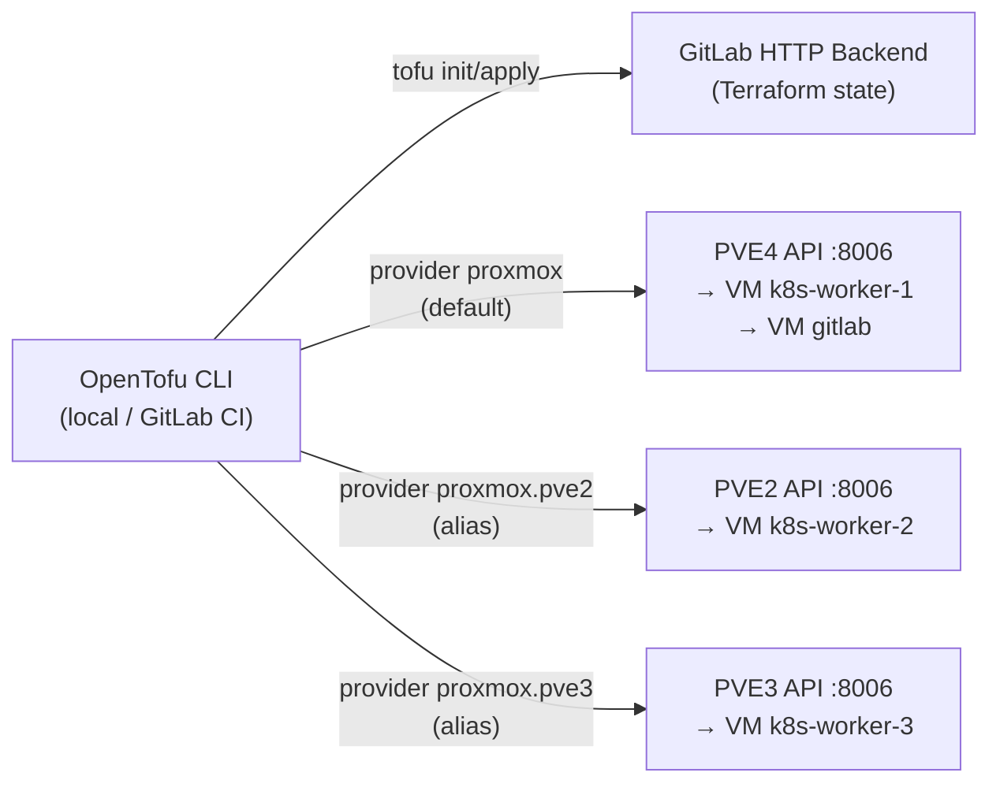

> This post is part of the [Homelab K8s GitOps series](/categories/homelab/). Start with the [architecture overview](/posts/homelab-k8s-gitops-series/) or jump in anywhere.

## TL;DR

- **What:** Provision four Ubuntu 24.04 VMs on three standalone Proxmox nodes using OpenTofu and the bpg/proxmox provider, with state stored in GitLab's HTTP backend
- **Why OpenTofu:** FOSS fork of Terraform under the Linux Foundation — no license surprises, mature bpg/proxmox provider, GitLab HTTP backend means no S3 needed
- **Time to complete:** ~45 min
- **Key gotcha:** Standalone Proxmox nodes have independent user databases. A single provider block cannot clone VMs across nodes — you need provider aliases, one per node. If your nodes are clustered, this doesn't apply to you
- **Prereqs:** Proxmox API token on each node, SSH key pair, OpenTofu installed, GitLab project with HTTP backend enabled

## What This Post Covers

This post covers opentofu proxmox vm provisioning across three standalone nodes (PVE2, PVE3, PVE4) using the bpg/proxmox provider with per-node aliases. By the end, you'll have four VMs running Ubuntu 24.04 with cloud-init, static IPs, and SSH access — all provisioned from code and with state stored in GitLab. I'll also cover the four gotchas that cost me the most time, so you don't repeat them.

## Why I Chose OpenTofu

I chose OpenTofu over Terraform because HashiCorp relicensed Terraform to BSL in 2023, which rules it out for any project where the license terms matter. OpenTofu is the Linux Foundation fork — same syntax, same providers, compatible state format, and governed by a foundation rather than a vendor. The switch costs nothing if you're starting fresh.

The bpg/proxmox provider is the only mature community provider for Proxmox. The official HashiCorp provider never existed; the Telmate provider is unmaintained. bpg/proxmox supports cloud-init injection, VM templates, disk management, and the full Proxmox API. It's the right choice.

For state, I used GitLab's built-in HTTP backend. This gives me remote state with locking at zero infrastructure cost — no S3 bucket, no DynamoDB table. GitLab projects under CE include Terraform state management out of the box.

> **Decision:** OpenTofu + bpg/proxmox provider + GitLab HTTP backend. No vendor lock-in, no cloud state storage cost, compatible with the existing GitLab CE instance.

## Architecture

The OpenTofu config connects directly to each Proxmox node's API endpoint. Each node runs its own API server, and since the nodes are standalone (not clustered), each has its own user database and token store. The diagram shows why a single provider block doesn't work here.



Each provider alias holds its own endpoint and API token. When OpenTofu runs `proxmox_virtual_environment_vm.k8s_worker_2`, it uses the `proxmox.pve2` alias — which connects directly to PVE2's API and clones the template that lives on PVE2. No cross-node communication, no routing through PVE4.

## Prerequisites

- Proxmox API token created on each node (PVE4 for Phase 0, PVE2 and PVE3 for Phase 1 — see steps below)
- Ubuntu 24.04 cloud-init template (VM ID 9000) created on each node that OpenTofu will clone from
- SSH key pair on your laptop — `~/.ssh/id_ed25519` and `~/.ssh/id_ed25519.pub`
- OpenTofu installed (`brew install opentofu` on macOS, or follow the [OpenTofu install docs](https://opentofu.org/docs/intro/install/){:target="_blank"})
- GitLab project created and GitLab PAT with `api` scope (not project token — see Gotcha 2)

## Step 1: Create Proxmox API Tokens

Proxmox tokens are scoped to a user. Create the user and token on each node independently — they do not share a database.

On PVE4 (and repeat on PVE2 and PVE3 with the same steps):

```bash
# In the PVE web UI: Datacenter → Users → Add
# Username: opentofu@pve
# Then: Datacenter → Permissions → Add → User Permission
# Path: /   Role: PVEAdmin   User: opentofu@pve
# Then: Users → opentofu@pve → API Tokens → Add
# ID: opentofu   Privilege Separation: unchecked
```

Or via CLI (SSH into each node):

```bash
# Run on each PVE node (SSH in as root)
pveum user add opentofu@pve --comment "OpenTofu automation user"
pveum aclmod / -user opentofu@pve -role PVEVMAdmin
pveum aclmod /storage -user opentofu@pve -role PVEDatastoreUser
pveum user token add opentofu@pve opentofu --privsep 0
```

The token format is `opentofu@pve!opentofu=<SECRET>`. Record the secret immediately — Proxmox shows it exactly once.

Record each token:
- `PROXMOX_TOKEN_ID_PVE4=opentofu@pve!opentofu`
- `PROXMOX_TOKEN_SECRET_PVE4=<displayed-value-from-PVE4>`
- `PROXMOX_TOKEN_ID_PVE2=opentofu@pve!opentofu`
- `PROXMOX_TOKEN_SECRET_PVE2=<displayed-value-from-PVE2>`
- `PROXMOX_TOKEN_ID_PVE3=opentofu@pve!opentofu`
- `PROXMOX_TOKEN_SECRET_PVE3=<displayed-value-from-PVE3>`

## Step 2: Provider Config with Aliases

The provider config is the part most tutorials get wrong for standalone nodes. Here's the `providers.tf` for the `k8s-workers` module:

```hcl
# opentofu/k8s-workers/providers.tf

terraform {
  backend "http" {}
  required_providers {
    proxmox = { source = "bpg/proxmox"; version = "~> 0.73" }
  }
  required_version = ">= 1.6.0"
}

# PVE4 — default provider (Worker 1)
provider "proxmox" {
  endpoint  = var.proxmox_endpoint_pve4
  api_token = var.proxmox_api_token_pve4
  insecure  = true   # Proxmox uses a self-signed cert by default
}

# PVE2 — alias provider (Worker 2)
provider "proxmox" {
  alias     = "pve2"
  endpoint  = var.proxmox_endpoint_pve2
  api_token = var.proxmox_api_token_pve2
  insecure  = true
}

# PVE3 — alias provider (Worker 3)
provider "proxmox" {
  alias     = "pve3"
  endpoint  = var.proxmox_endpoint_pve3
  api_token = var.proxmox_api_token_pve3
  insecure  = true
}
```

The Phase 0 GitLab VM config (`opentofu/gitlab-vm/providers.tf`) is simpler — only PVE4, no aliases needed:

```hcl
# opentofu/gitlab-vm/providers.tf

terraform {
  backend "http" {}
  required_providers {
    proxmox = {
      source  = "bpg/proxmox"
      version = "~> 0.73"
    }
  }
  required_version = ">= 1.6.0"
}

provider "proxmox" {
  endpoint  = var.proxmox_endpoint
  api_token = var.proxmox_api_token
  insecure  = true
}
```

## Step 3: VM Resource Config

Each worker VM is a separate resource pinned to its provider alias. The previous `for_each` pattern doesn't work here — `for_each` can't dynamically select a provider, and provider assignment must be static.

```hcl
# opentofu/k8s-workers/main.tf

# Worker 1 on PVE4 (default provider)
resource "proxmox_virtual_environment_vm" "k8s_worker_1" {
  name      = "k8s-worker-1"
  node_name = "pve4"
  vm_id     = 201
  clone     { vm_id = var.template_vm_id_pve4; full = true }
  cpu       { cores = 4;  type = "x86-64-v2-AES" }
  memory    { dedicated = 16384 }
  disk      { datastore_id = var.proxmox_storage_pve4; interface = "scsi0"; size = 60; discard = "on" }
  network_device { bridge = "vmbr0"; model = "virtio" }
  agent     { enabled = true }
  initialization {
    ip_config { ipv4 { address = "172.16.15.12/16"; gateway = "172.16.0.1" } }
    dns       { servers = ["172.16.0.1"] }
    user_account { username = "ubuntu"; keys = [var.ssh_public_key] }
  }
  lifecycle { ignore_changes = [initialization] }
}

# Worker 2 on PVE2 (alias provider proxmox.pve2)
resource "proxmox_virtual_environment_vm" "k8s_worker_2" {
  provider  = proxmox.pve2
  name      = "k8s-worker-2"
  node_name = "pve2"
  vm_id     = 202
  clone     { vm_id = var.template_vm_id_pve2; full = true }
  cpu       { cores = 4;  type = "x86-64-v2-AES" }
  memory    { dedicated = 10240 }
  disk      { datastore_id = var.proxmox_storage_pve2; interface = "scsi0"; size = 60; discard = "on" }
  network_device { bridge = "vmbr0"; model = "virtio" }
  agent     { enabled = true }
  initialization {
    ip_config { ipv4 { address = "172.16.15.13/16"; gateway = "172.16.0.1" } }
    dns       { servers = ["172.16.0.1"] }
    user_account { username = "ubuntu"; keys = [var.ssh_public_key] }
  }
  lifecycle { ignore_changes = [initialization] }
}

# Worker 3 on PVE3 (alias provider proxmox.pve3)
resource "proxmox_virtual_environment_vm" "k8s_worker_3" {
  provider  = proxmox.pve3
  name      = "k8s-worker-3"
  node_name = "pve3"
  vm_id     = 203
  clone     { vm_id = var.template_vm_id_pve3; full = true }
  cpu       { cores = 6;  type = "x86-64-v2-AES" }
  memory    { dedicated = 12288 }
  disk      { datastore_id = var.proxmox_storage_pve3; interface = "scsi0"; size = 60; discard = "on" }
  network_device { bridge = "vmbr0"; model = "virtio" }
  agent     { enabled = true }
  initialization {
    ip_config { ipv4 { address = "172.16.15.14/16"; gateway = "172.16.0.1" } }
    dns       { servers = ["172.16.0.1"] }
    user_account { username = "ubuntu"; keys = [var.ssh_public_key] }
  }
  lifecycle { ignore_changes = [initialization] }
}
```

## Step 4: Variables and tfvars.example

```hcl
# opentofu/k8s-workers/variables.tf

variable "proxmox_endpoint_pve4" { type = string; default = "https://172.16.4.2:8006/" }
variable "proxmox_endpoint_pve2" { type = string; default = "https://172.16.2.1:8006/" }
variable "proxmox_endpoint_pve3" { type = string; default = "https://172.16.3.1:8006/" }

variable "proxmox_api_token_pve4" { type = string; sensitive = true }
variable "proxmox_api_token_pve2" { type = string; sensitive = true }
variable "proxmox_api_token_pve3" { type = string; sensitive = true }

variable "ssh_public_key" { type = string }

variable "proxmox_storage_pve4" { type = string; default = "local-lvm" }
variable "proxmox_storage_pve2" { type = string; default = "StorageSlow" }
variable "proxmox_storage_pve3" { type = string; default = "StorageOne" }

variable "template_vm_id_pve4" { type = number; default = 9000 }
variable "template_vm_id_pve2" { type = number; default = 9000 }
variable "template_vm_id_pve3" { type = number; default = 9000 }
```

The `terraform.tfvars.example` is the safe version that goes into git — no real secrets:

```hcl
# opentofu/k8s-workers/terraform.tfvars.example

proxmox_api_token_pve4 = "opentofu@pve!opentofu=<PVE4_TOKEN_SECRET>"
proxmox_api_token_pve2 = "opentofu@pve!opentofu=<PVE2_TOKEN_SECRET>"
proxmox_api_token_pve3 = "opentofu@pve!opentofu=<PVE3_TOKEN_SECRET>"
ssh_public_key         = "ssh-ed25519 AAAA..."
```

The real `terraform.tfvars` stays local (or becomes GitLab CI variables). Never commit it.

## Step 5: GitLab HTTP Backend

The HTTP backend config goes in `providers.tf` as `backend "http" {}` — all the connection details pass in at `tofu init` time, not in the code. This keeps the backend URL (which contains your project ID) out of the repository.

Run this once to initialize and migrate local state to GitLab:

```bash
# Get your project ID
GITLAB_PROJECT_ID=$(curl -sk \
  --header "PRIVATE-TOKEN: <your-gitlab-pat>" \
  https://gitlab.dev.noobhackker.com/api/v4/projects/root%2Fbastion-k8s \
  | python3 -c "import sys,json; print(json.load(sys.stdin)['id'])")

TF_ADDRESS="https://gitlab.dev.noobhackker.com/api/v4/projects/${GITLAB_PROJECT_ID}/terraform/state/k8s-workers"

tofu init \
  -backend-config="address=${TF_ADDRESS}" \
  -backend-config="lock_address=${TF_ADDRESS}/lock" \
  -backend-config="unlock_address=${TF_ADDRESS}/lock" \
  -backend-config="username=root" \
  -backend-config="password=<your-gitlab-pat>" \
  -backend-config="lock_method=POST" \
  -backend-config="unlock_method=DELETE" \
  -backend-config="retry_wait_min=5"
```

Expected: `Terraform has been successfully initialized!`

After init, verify the state appears at GitLab project → Infrastructure → Terraform states.

For CI runs, GitLab CI sets these automatically when you use the `TF_STATE_NAME` variable and the built-in `$CI_JOB_TOKEN`. The worker pipeline sets `TF_STATE_NAME: k8s-workers` and passes the backend config via environment variables — the PAT is only needed for the initial local migration.

## Gotchas and Lessons Learned

**Standalone Proxmox nodes require per-node provider aliases.** This is the one that costs everyone an hour. If PVE2, PVE3, and PVE4 are standalone nodes (not joined in a Proxmox cluster), each has its own user database. A single provider block connecting to PVE4's API cannot tell PVE4 to clone a VM onto PVE2 — PVE4 doesn't know PVE2 exists. OpenTofu fails with a 500 or a cryptic "node not found" error from the Proxmox API. The fix is provider aliases: one provider block per node, each with its own endpoint and token. If your nodes ARE clustered, this doesn't apply — one token propagates to all nodes and one provider block works fine.

**GitLab HTTP backend requires a Personal Access Token with `api` scope — not a Project Access Token.** Project Access Tokens have a narrower permission set and do not have the `api` scope that the Terraform state API requires. The `tofu init` command will fail with a 403 if you use a project token. Create a Personal Access Token (Profile → Access Tokens → New token → `api` scope) and use that for the `-backend-config="password=..."` flag. This token only needs to exist long enough to do the local migration — after that, GitLab CI uses `$CI_JOB_TOKEN` automatically.

**`terraform.tfvars` must not be committed. Add it to `.gitignore`.** The `.gitignore` pattern is `**/*.tfvars` with `!**/terraform.tfvars.example` as an exception. The `!` exception lets you commit the example file while keeping the real one local. For CI, set GitLab CI/CD variables with the `TF_VAR_` prefix — OpenTofu reads `TF_VAR_proxmox_api_token_pve2` automatically as `var.proxmox_api_token_pve2`. Mark all token variables as Masked and Protected in GitLab.

**The cloud-init SSH key must already exist before `tofu apply`.** OpenTofu injects `var.ssh_public_key` into the VM's cloud-init config via the `user_account.keys` block. If the key doesn't exist yet, generate it first:

```bash
ssh-keygen -t ed25519 -C "homelab-k8s" -f ~/.ssh/id_ed25519
```

Then copy the public key content:

```bash
cat ~/.ssh/id_ed25519.pub
```

Set `SSH_PUBLIC_KEY` (for local `tfvars`) or `TF_VAR_ssh_public_key` (for CI) to the full public key string. The key must be `ssh-ed25519 AAAA...` format — OpenTofu passes it verbatim to cloud-init, which writes it to `~/.ssh/authorized_keys` on first boot.

## Conclusion

Four VMs provisioned across three standalone Proxmox nodes, all from code, with state in GitLab and no manual steps after initial token creation. The provider alias pattern is the non-obvious part — once you understand that standalone nodes are isolated API endpoints, the solution is obvious. Clustered Proxmox is easier to manage from OpenTofu; standalone is what I have, and the alias approach works reliably.

## What's Next

Next up: bootstrapping the K3s cluster with Ansible — server config, worker join, Cilium CNI, and the passwordless sudo gotcha that causes a misleading token error. [Post #2: K3s Cluster Bootstrap with Ansible](/posts/k3s-ansible-bootstrap-proxmox/).
