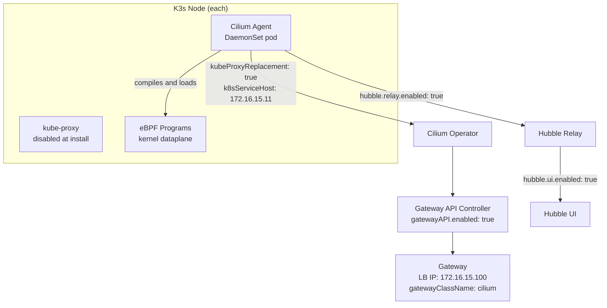

> This post is part of the [Homelab K8s GitOps series](/categories/homelab/). Start with the [architecture overview](/posts/homelab-k8s-gitops-series/) or jump in anywhere.

## TL;DR

- **What:** Cilium installed as the sole CNI on K3s with full kube-proxy replacement via eBPF
- **Why Cilium over Flannel:** Native Gateway API support — Flannel has none. Cilium replaces kube-proxy, enforces NetworkPolicy, and delivers Hubble network observability in a single Helm install.
- **Time to complete:** ~30 min
- **Key gotcha:** Gateway API CRDs must be installed before Cilium. If Cilium starts without them, the Gateway API controller never initializes — and restarting the DaemonSet does not fix it. You must reinstall Cilium.
- **Prereqs:** [K3s Bootstrap with Ansible](/posts/k3s-ansible-bootstrap-proxmox/) — K3s must be installed with `--disable-kube-proxy` before Cilium goes in

## What This Post Covers

I chose Cilium over Flannel for one reason that settled the decision immediately: Flannel has no Gateway API implementation. Cilium does, and configuring cilium cni k3s kube-proxy replacement in the same Helm install means two problems solved with one chart. eBPF replaces kube-proxy entirely, Hubble gives per-flow network visibility, and the Gateway API controller handles ingress routing without a separate Traefik or ingress controller.

This post covers the exact configuration for Phase 2 of the homelab GitOps stack: the K3s server flags that must be set before Cilium installs, the correct CRD-first install sequence, the minimum `cilium-values.yaml` for kube-proxy replacement on K3s, and what Hubble requires that is not enabled by default. By the end, Cilium is running as both the CNI and the kube-proxy replacement, Hubble is collecting per-flow data, and the Gateway API controller has registered its GatewayClass.

> **Key Takeaways**
>
> - Cilium replaces kube-proxy entirely on K3s using eBPF — no iptables chain, no kube-proxy process
> - Gateway API CRDs must exist before Cilium starts or the controller never initializes (and DaemonSet restart does not fix this)
> - K3s must be installed with `--disable-kube-proxy` — a conflict between kube-proxy and Cilium requires a full K3s reinstall to recover
> - Three values are mandatory in `cilium-values.yaml` for K3s: `kubeProxyReplacement: true`, `k8sServiceHost`, `k8sServicePort`
> - Hubble UI requires both `hubble.relay.enabled: true` and `hubble.ui.enabled: true` — neither is on by default

## Why I Chose Cilium

Flannel is K3s's default CNI because it's lightweight and works with zero configuration. For a cluster that only needs basic pod networking, Flannel is the right call. This stack needs more than that: Gateway API for ingress routing, NetworkPolicy for namespace isolation, and Hubble for debugging network flows when something breaks. Flannel provides none of those. Cilium provides all three.

The eBPF data plane matters on its own terms too. Cilium compiles routing rules directly into the kernel and processes packets without traversing the iptables chain that kube-proxy maintains. Hubble instruments those eBPF programs directly, which means flow visibility without an additional agent.

The alternative I considered was Calico. Calico has NetworkPolicy support and is well-documented, but it has no native Gateway API implementation either — you'd still need a separate ingress controller. Cilium implements the Gateway API spec natively as part of its Operator, so adding it means one less component to manage.

> **Decision:** Cilium over Flannel because Gateway API support alone justifies the switch. eBPF performance and Hubble observability are meaningful additions for a homelab running production-grade workloads.

## Architecture

Each K3s node runs a Cilium Agent pod as part of a DaemonSet. The agent compiles eBPF programs and loads them into the kernel, replacing the iptables rules that kube-proxy would otherwise manage. At the cluster level, the Cilium Operator runs the Gateway API controller (once the CRDs are present) and Hubble Relay aggregates per-flow data from all node agents. The Gateway API controller registers a GatewayClass named `cilium` and watches for Gateway and HTTPRoute resources.



The `kubeProxyReplacement: true` flag tells Cilium to own all service routing that kube-proxy would otherwise handle. Cilium needs to know the API server address to do this correctly, which is why `k8sServiceHost` and `k8sServicePort` are required on K3s specifically. K3s doesn't expose the API server address through the standard cluster DNS path that Cilium uses on kubeadm clusters, so the control plane IP goes in directly.

## Prerequisites

- K3s installed with `--disable-kube-proxy`, `flannel-backend: none`, and `disable: [servicelb, traefik]` — see [K3s Bootstrap with Ansible](/posts/k3s-ansible-bootstrap-proxmox/)
- `kubectl` access to the cluster (from the GitLab VM or your workstation)
- Helm 3.x installed
- Control plane IP available: this setup uses `172.16.15.11`

## Step 1: K3s Server Configuration

K3s must be installed with the correct flags before Cilium goes in. The configuration that matters for Cilium lives in `/etc/rancher/k3s/config.yaml` on the control plane node:

```yaml
# k3s-server-config.yaml
write-kubeconfig-mode: "0644"
cluster-init: true
flannel-backend: none        # disable Flannel — Cilium is the CNI
disable-network-policy: true # Cilium handles NetworkPolicy
disable-kube-proxy: true     # Cilium replaces kube-proxy via eBPF
disable:
  - servicelb                # Cilium LB IPAM replaces this
  - traefik                  # no Traefik competing with Gateway API
  - local-storage
node-taint:
  - "node-role.kubernetes.io/control-plane=true:NoSchedule"
tls-san:
  - 172.16.15.11
  - k8s-cp
```

`flannel-backend: none` removes Flannel entirely. `disable-network-policy: true` removes K3s's built-in policy controller so Cilium can own it. `disable: [servicelb]` prevents the K3s LoadBalancer implementation from conflicting with Cilium's LB IPAM, which later assigns the `172.16.15.100` Gateway IP via the `io.cilium/lb-ipam-ips` annotation.

These flags cannot be added after K3s is already installed. If kube-proxy is running when Cilium starts, both compete to manage iptables rules and the cluster enters a broken state. See Gotcha 3 for the recovery path (spoiler: it's a full reinstall).

## Step 2: Install Gateway API CRDs Before Cilium

Gateway API CRDs must be installed before Cilium. Cilium reads the CRDs at startup to decide whether to enable the Gateway API controller. If the CRDs are absent when the DaemonSet initializes, the controller is skipped and no error is written anywhere.

```bash
# Install Gateway API standard CRDs — run before helm install cilium
kubectl apply -f https://github.com/kubernetes-sigs/gateway-api/releases/download/v1.2.0/standard-install.yaml
```

Verify the CRDs are present before proceeding:

```bash
# Verify Gateway API CRDs are installed
kubectl get crd \
  gateways.gateway.networking.k8s.io \
  gatewayclasses.gateway.networking.k8s.io \
  httproutes.gateway.networking.k8s.io
# Expected: all three listed with an age
```

The Ansible task file `cilium.yml` enforces this ordering explicitly — the CRD install task runs first, the Cilium manifest applies second, and `kubectl rollout status` waits for the DaemonSet to be fully ready before the play continues.

## Step 3: Write cilium-values.yaml

Three fields are required for kube-proxy replacement on K3s. The rest enables Gateway API and Hubble:

```yaml
# cilium-values.yaml
kubeProxyReplacement: true
k8sServiceHost: "172.16.15.11"  # control plane IP — not DNS
k8sServicePort: "6443"

gatewayAPI:
  enabled: true

hubble:
  relay:
    enabled: true
  ui:
    enabled: true

operator:
  replicas: 1  # single control plane node

ipam:
  mode: "kubernetes"
```

`k8sServiceHost` must be the IP address, not a hostname. K3s doesn't put the API server address into the cluster DNS where Cilium normally looks for it on kubeadm installs. Without this value, Cilium's kube-proxy replacement fails to locate the API server and pod networking breaks entirely. The cluster will appear to come up fine and then fail in ways that look like random network issues.

`gatewayAPI.enabled: true` registers the `cilium` GatewayClass. The controller only appears if both this flag is set and the CRDs were present at startup. Both conditions must be true.

`hubble.relay.enabled: true` and `hubble.ui.enabled: true` are both required for the Hubble web interface. The relay aggregates per-flow data from all node agents. The UI pod depends on the relay. If only the relay is enabled, no UI pod starts. If the relay is missing, the UI pod starts and crashes immediately. Neither is enabled by default.

## Step 4: Helm Install and Verification

Add the Cilium repo and install with the values file:

```bash
# Install Cilium via Helm
helm repo add cilium https://helm.cilium.io/
helm repo update

helm install cilium cilium/cilium \
  --namespace kube-system \
  --version 1.16.0 \
  -f cilium-values.yaml \
  --wait --timeout 5m
```

Verify the DaemonSet is running on all nodes:

```bash
# Verify Cilium DaemonSet is running on all nodes
kubectl get pods -n kube-system -l k8s-app=cilium
# Expected: one Running pod per node (4 pods for this 4-node cluster)
```

Verify the Gateway API controller registered its GatewayClass:

```bash
# Check GatewayClass registration
kubectl get gatewayclass cilium
# Expected: NAME=cilium, ACCEPTED=True
```

If `ACCEPTED` is `False` or the GatewayClass doesn't exist, the CRDs were likely absent at Cilium startup. See Gotcha 1 below for the fix.

Check Hubble pods:

```bash
# Verify Hubble relay and UI are running
kubectl get pods -n kube-system -l k8s-app=hubble-relay
kubectl get pods -n kube-system -l k8s-app=hubble-ui
# Expected: both Running
```

Confirm kube-proxy is gone:

```bash
# Confirm kube-proxy is not running
kubectl get pods -n kube-system -l component=kube-proxy
# Expected: No resources found
```

If kube-proxy pods appear here, K3s was not installed with `--disable-kube-proxy`. See Gotcha 3.

## Gotchas and Lessons Learned

<!-- PERSONAL EXPERIENCE: All four gotchas below are from the Phase 2 build. Each one caused real downtime or rework and has a specific, confirmed fix. -->

**Gotcha 1: Gateway API CRDs must exist before Cilium starts.**

<!-- UNIQUE INSIGHT: The non-obvious part is that DaemonSet restart does not re-run startup detection — full reinstall is required. This took 2 hours to diagnose because Cilium showed no errors at all. -->

I installed Cilium before the Gateway API CRDs. Cilium came up fine: all pods Running, cluster healthy, no errors in any pod logs. The Gateway API controller simply never appeared. I spent two hours checking values.yaml settings, re-reading the Cilium documentation, and verifying every Helm flag before tracing it back to install order.

The mechanism: Cilium reads the CRDs at startup to determine whether to enable the Gateway API controller. No CRDs at startup means no controller. The DaemonSet stays `Running` and reports healthy because everything else works. There is no warning, no failed pod, no event that points at the missing CRDs.

Restarting the Cilium DaemonSet after adding the CRDs does not fix this. Cilium must be fully reinstalled because the startup detection only runs during pod initialization, not during a restart.

Fix: install CRDs, verify with `kubectl get crd gatewayclasses.gateway.networking.k8s.io`, then install Cilium.

```bash
# Confirm CRDs exist, then reinstall
kubectl apply -f https://github.com/kubernetes-sigs/gateway-api/releases/download/v1.2.0/standard-install.yaml

helm uninstall cilium -n kube-system
helm install cilium cilium/cilium \
  --namespace kube-system \
  --version 1.16.0 \
  -f cilium-values.yaml \
  --wait --timeout 5m
```

**Gotcha 2: K3s requires explicit API server IP — not DNS — in Cilium values.**

Without `k8sServiceHost` and `k8sServicePort`, Cilium's kube-proxy replacement cannot locate the API server. The symptom is Cilium DaemonSet pods in `CrashLoopBackOff` with errors like `failed to connect to api server` in the pod logs. K3s doesn't expose the API server through the cluster DNS mechanism Cilium uses on kubeadm clusters.

The value must be the IP address directly:

```yaml
# cilium-values.yaml (required for K3s kube-proxy replacement)
kubeProxyReplacement: true
k8sServiceHost: "172.16.15.11"  # control plane IP, not DNS
k8sServicePort: "6443"
```

Using a hostname here fails silently in some configurations and fails loudly in others. Use the IP.

**Gotcha 3: Kube-proxy conflict requires a full K3s reinstall.**

If K3s was installed without `--disable-kube-proxy` and Cilium is deployed later with `kubeProxyReplacement: true`, both Cilium and kube-proxy try to manage iptables rules for the same service VIPs. The cluster enters an inconsistent state where some services work and others don't, depending on which component processed each rule last. The failure mode is non-deterministic and extremely difficult to debug.

There is no graceful recovery. The fix is a full uninstall and reinstall:

```bash
# On each worker node
/usr/local/bin/k3s-agent-uninstall.sh

# On the control plane
/usr/local/bin/k3s-uninstall.sh
```

Then reinstall K3s with `disable-kube-proxy: true` in the config before reinstalling Cilium. This is a destructive operation on a running cluster. The time to prevent it is before K3s's first install.

**Gotcha 4: Hubble UI requires two separate flags and an HTTPRoute to expose.**

`hubble.relay.enabled: true` and `hubble.ui.enabled: true` are separate flags and both are required. If the relay is missing, the UI pod starts and immediately crashes with a connection refused error. If only the relay is enabled, the relay pod runs but no UI pod ever appears.

Both flags belong in `cilium-values.yaml`:

```yaml
# cilium-values.yaml (Hubble section)
hubble:
  relay:
    enabled: true
  ui:
    enabled: true
```

The Hubble UI service (`hubble-ui` in `kube-system`, port 80) needs an HTTPRoute and a ReferenceGrant to be reachable through the Gateway. The HTTPRoute and ReferenceGrant configuration for Hubble is covered in the next post alongside the rest of the Gateway routing setup.

## Conclusion

Cilium is running as the sole CNI on the K3s cluster, kube-proxy is gone, Hubble is collecting per-flow data from eBPF programs on every node, and the Gateway API controller has registered its GatewayClass. The cluster can now accept Gateway and HTTPRoute resources. What it doesn't have yet is a Gateway object with an assigned LB IP, wildcard TLS certificates from cert-manager, or HTTPRoutes pointing at any service. That's Phase 4.

## What's Next

Next up: [Gateway API + Internal DNS](/posts/kubernetes-gateway-api-cilium-internal-dns/) — creating the Cilium Gateway at `172.16.15.100`, issuing wildcard TLS certificates via cert-manager, and wiring up HTTPRoutes for every internal service including Hubble UI.

**Related posts:**

- [K3s Bootstrap with Ansible](/posts/k3s-ansible-bootstrap-proxmox/) — the K3s install configuration that Cilium depends on, including the `--disable-kube-proxy` flag that must be set before Cilium goes in
- [ArgoCD + App of Apps](/posts/argocd-app-of-apps/) — how the rest of the stack is deployed declaratively once Cilium's Gateway is handling ingress routing
